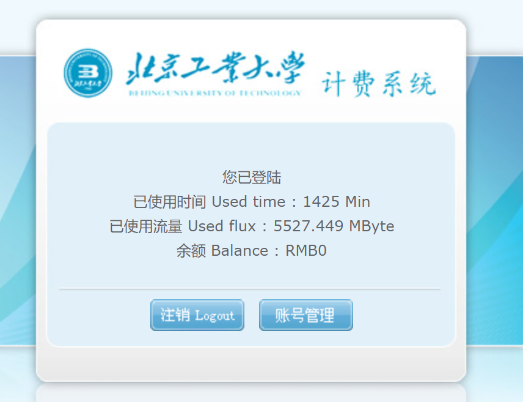

# Vps 转发 Ipv6

 

## 1. VPS 准备部分：

### 1. 购买

https://my.vultr.com/， 新用户充值10美元赠送100美元，支持支付宝。

### 2. 实例化vps


根据个人情况选择服务器位置，为方便部署，系统选择centos7，服务器价格选择最低5美元/月即可。


注意勾选启用IPv6，完全结束后点击部署，等待部署完成即可。

### 3. 查询vps的ipv6地址：


进入vps实例信息后，按如图所示点击。

---

## 2. ssr部署

使用ssh连接服务器。

首先尝试该vps是否能够同时ping通内外网

```shell
ping google.com
ping bilibili.com
```

若均成功则继续进行部署，若失败则更换部署位置部署新的vps。

有的系统会开启防火墙，部署前请手动关闭

```shell
# 查看防火墙状态命令：
firewall-cmd — state
# 停止firewall命令：
systemctl stop firewalld.service
# 禁止firewall开机启动命令：
systemctl disable firewalld.service
```

下载ssr部署脚本

```shell
yum -y install wget

wget -N — no-check-certificate https://raw.githubusercontent.com/ToyoDAdoubi/doubi/master/ssr.sh && chmod +x ssr.sh && bash ssr.sh
```

进行部署，脚本为中文界面，根据提示操作即可。

```shell
bash ssr.sh
```


配置完成后出现上述信息，部署完成。

---

## 3. BBR加速部署

centos7系统使用谷歌BBR加速

```shell
wget — no-check-certificate https://github.com/teddysun/across/raw/master/bbr.sh

chmod +x bbr.sh

./bbr.sh
```

顺利完成后服务器会自动重启

---

## 4. PC端登录：

### 1. 配置ssr

首先准备ssr，在ssr中输入自己vps的信息，输入信息与上图中展示信息相同。


### 2. Ipv6登录校园网

https://lgn6.bjut.edu.cn/，输入学号密码进行登录。

### 3. 设置全局代理

代理地址为127.0.0.1，端口为1080


### 4. 完成连接

可以尝试登录国内和国外网站。

---

##  5. ios端登录

下载Shadowrocket实现代理功能, 点击右上方加号新建代理规则

### 1. 直连校园网ipv6

使用ssr进行代理

节点类型选择`ShadowsocksR`, 其他参数按照pc端相同方式进行录入

### 2. pc端登录ipv6, 开启ssr,  并开启移动热点 ( 不买路由器方法 )

该方法可以实现电脑和手机同时实现网络访问. 

节点类型选择`HTTP`, 地址输入wifi网络中pc的地址, 端口设置为1080

> 若连接后设备ip地址为192.168.137.41, 则pc地址为192.168.137.1


---


# 流量记录:

### 2021年9月2日14点24分:


