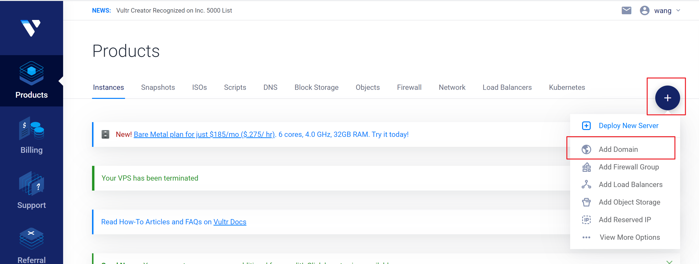
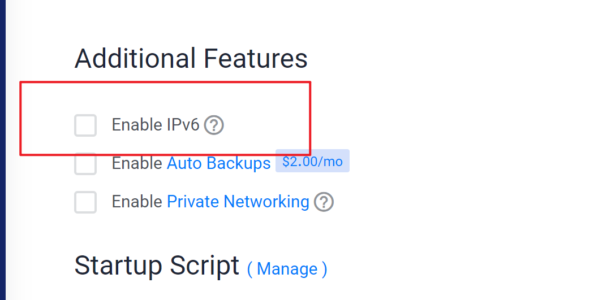
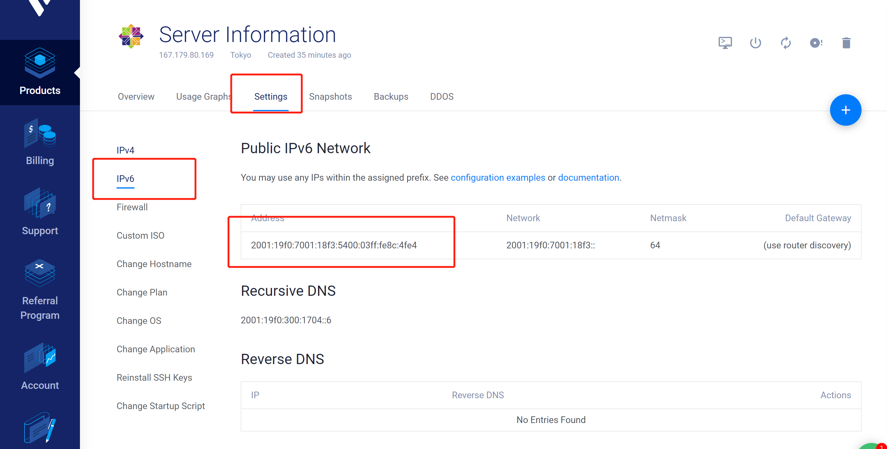
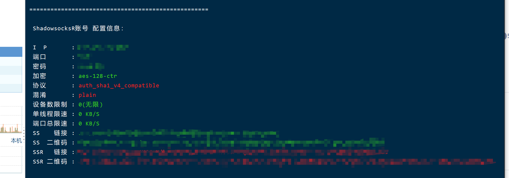
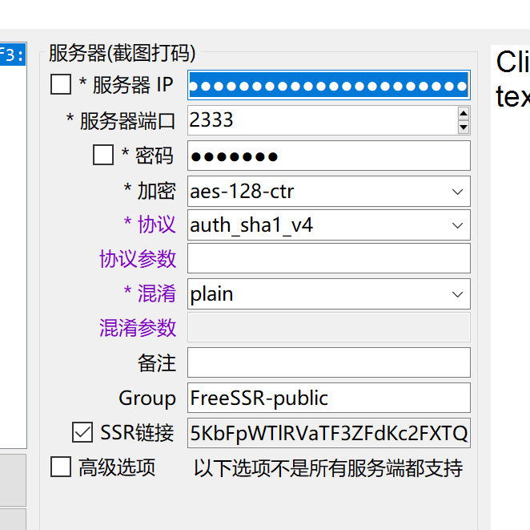
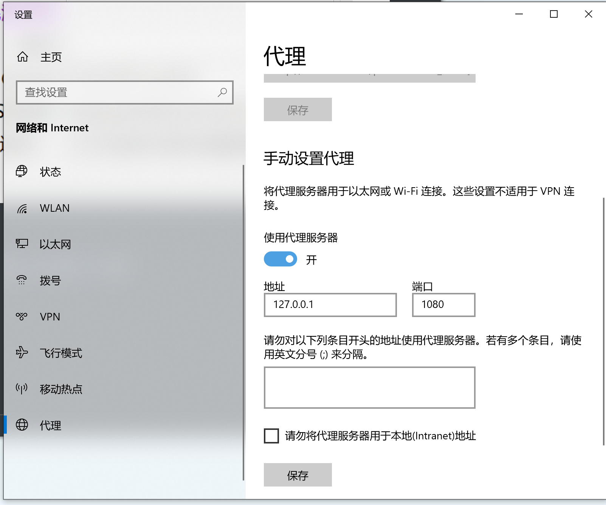
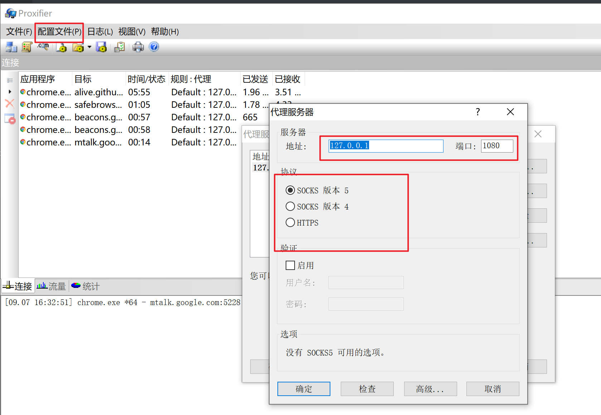
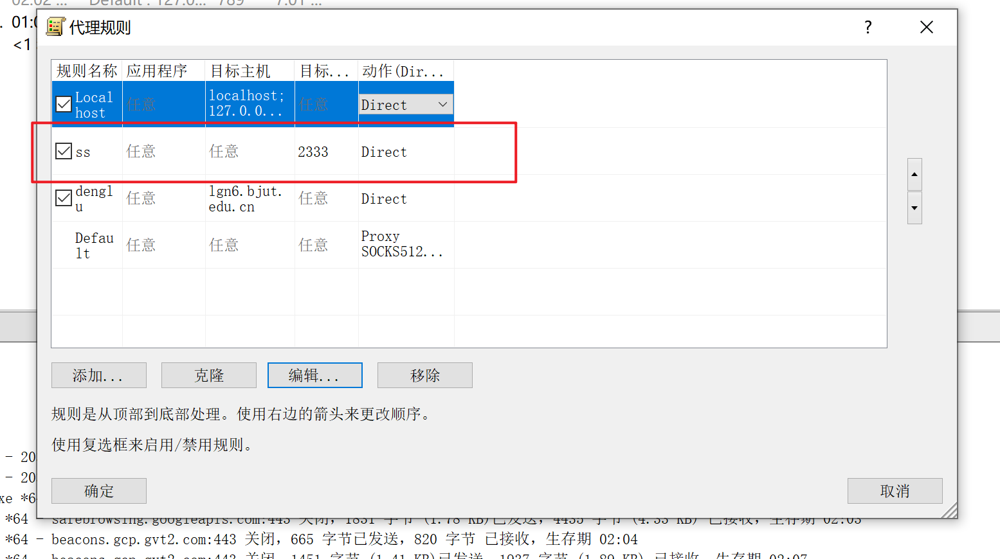
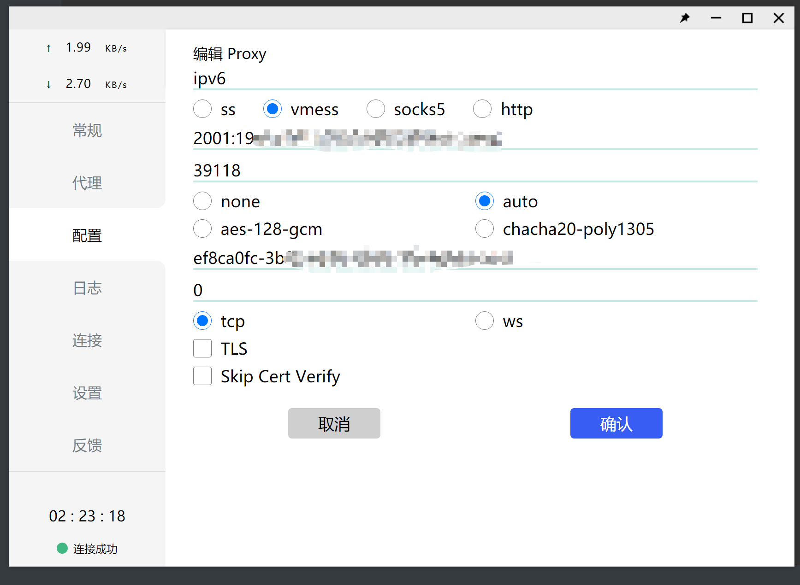

# Vps 转发 Ipv6

- 2021年10月18日09:30:22 更新 V2ray服务部署

开学发现学校的校园网每月只有30g，超出部分2元1g，这可太不能接受了。

校园网的ipv6流量没有限制，但不能直接正常访问ipv4资源，所以我们可以租个提供ipv6地址的vps，来实现流量转发，进而实现我们校园网的“白嫖”。

## 1. VPS 准备部分：

### 1. 购买

推荐使用国内服务器进行部署，国外服务器连接国内网络速度较慢。

选择服务器运营商时必须要确定其能提供Ipv6地址。

我自己用的是这个：[vultr](https://www.vultr.com/?ref=8918028)

日本节点5美元一个月，新用户充值10美元赠送100美元，但只有一个月，相当于10块用仨月，支持支付宝。

### 2. 实例化vps



根据个人情况选择服务器位置，为方便部署，系统选择centos7，服务器价格选择最低5美元/月即可。



注意勾选启用IPv6，完全结束后点击部署，等待部署完成即可。

### 3. 查询vps的ipv6地址：



进入vps实例信息后，按如图所示点击。

---

## 2. ssr部署

使用ssh连接服务器。

首先尝试该vps是否能够同时ping通内外网

```shell
ping google.com
ping bilibili.com
```

若均成功则继续进行部署，若失败则更换部署位置部署新的vps。

有的系统会开启防火墙，部署前请手动关闭

```shell
# 查看防火墙状态命令：
firewall-cmd --state
# 停止firewall命令：
systemctl stop firewalld.service
# 禁止firewall开机启动命令：
systemctl disable firewalld.service
```

下载ssr部署脚本

```shell
yum -y install wget

wget -N — no-check-certificate https://raw.githubusercontent.com/ToyoDAdoubi/doubi/master/ssr.sh && chmod +x ssr.sh && bash ssr.sh
```

进行部署，脚本为中文界面，根据提示操作即可。

```shell
bash ssr.sh
```



配置完成后出现上述信息，部署完成。

---

## 3. BBR加速部署

centos7系统使用谷歌BBR加速

```shell
wget — no-check-certificate https://github.com/teddysun/across/raw/master/bbr.sh

chmod +x bbr.sh

./bbr.sh
```

顺利完成后服务器会自动重启

---

## 4. PC端登录：

### 1. 配置ssr

首先准备ssr,可以在附件中找到，在ssr中输入自己vps的信息，输入信息与上图中展示信息相同。



### 2. Ipv6登录校园网

https://lgn6.bjut.edu.cn/
，输入学号密码进行登录。

### 3. 设置全局代理

代理地址为127.0.0.1，端口为1080



### 4. 完成连接

可以尝试登录国内和国外网站。

---

##  5. ios端登录

下载Shadowrocket实现代理功能, 点击右上方加号新建代理规则

### 1. 直连校园网ipv6

使用ssr进行代理

节点类型选择`ShadowsocksR`, 其他参数按照pc端相同方式进行录入

### 2. pc端登录ipv6, 开启ssr,  并开启移动热点 ( 不买路由器方法 )

该方法可以实现电脑和手机同时实现网络访问. 

节点类型选择`HTTP`, 地址输入wifi网络中pc的地址, 端口设置为1080

> 若连接后设备ip地址为192.168.137.41, 则pc地址为192.168.137.1

---

## 6.  proxifier 全局代理

在之前的pc端配置中, 对于系统代理, 我们只在控制面板中配置了Http代理.

这导致了我们在浏览器中的访问可以得到转发, 但系统应用得不到转发, 不能进行正常的联网.

所以我们使用 Proxifier 进行全局代理, 实现我们的应用访问互联网


### 1. 配置转发端口



如图进行配置即可

### 2. 设置端口放行



为了防止Proxifier对于我们的ssr请求进行拦截, 我们需要对ssr发出的请求进行放行, 只需配置对应端口放行即可, 一般不会有应用使用2333端口进行通信

> 若遇到某些应用不能正常访问网络, 可以考虑其是否为2333端口

## 7. V2ray部署

​	搞V2ray服务部署原因是以为clash会自带全局代理，其实并没有，还是得用proxifier。

​	但使用V2ray后，proxifier全局代理后可以翻墙了（？？？）。猜测是因为ssr配置里，socket5的绕行规则需要单独配置，但我没找到。。

​	实际使用上目测和ssr没有显著差别，有待继续观察。

### 1. 服务器部署

​	脚本安装命令：

```shell
bash <(curl -s -L https://git.io/v2ray.sh)
```

​	安装过程按照自己偏好选择即可，不再赘述，不想麻烦的直接默认配置即可。

​	安装完成后，可以使用命令调用管理功能。

```shell
v2ray
```

​	查看 v2ray 的监听信息，若没有本机 ipv6 地址的监听，则需要进行配置文件的修改。

```shell
netstat -anp |grep v2ray
# 配置文件修改
nano /etc/v2ray/config.json 
# 文件展示内容
{
        "log": {
                "access": "/var/log/v2ray/access.log",
                "error": "/var/log/v2ray/error.log",
                "loglevel": "warning"
        },
        "inbounds": [
                {
                        "port": 39118,
                        "protocol": "vmess",
                        # 添加这个listen数据项
                        "listen": "0.0.0.0",
                        "settings": {
                                "clients": [
                                        {
                                                "id": "ef8ca0fc-3bf5-4d3d-b8c8-36c446d1aab2",
                                                "level": 1,
                                                "alterId": 0
                                        }
                                ]
                        },
	...
}
```

### 2. 客户端设置

​	直接添加vmess节点即可，手机端小火箭直接添加，pc端使用了clash进行管理，节点配置如下：



​	测试连接能连通后，还需使用proxifier进行全局代理，记得更改端口和规则，将clash放行。
